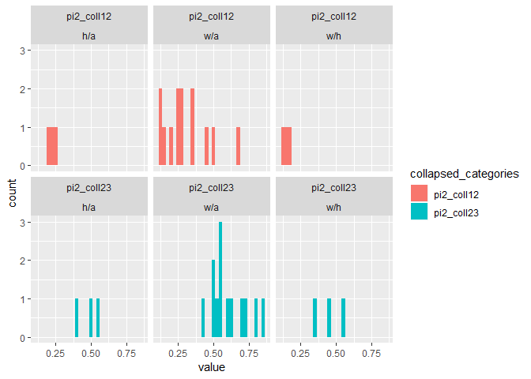

Malnutritional analysis
================

This model uses code developed by Nicky Welton to estimate the
association between malnutrition and pneumonia
mortality.

``` r
knitr::opts_chunk$set(echo = TRUE, warning = FALSE, message = FALSE, cache = TRUE)
knitr::opts_knit$set(root.dir = here::here())
```

Packages

``` r
library(tidyverse)
library(rjags)
library(ggplot2)
library(R2OpenBUGS)
```

# Fixed effects model

## Run model with example data

First check the model runs succesfully in Jags using example data.

Need to convert the example data into matrices and vectors for JAGS.

``` r
metadata <- list(ng=3,ns=24)
ex_df <- read_delim("Supporting/example_data.txt", delim = "\t")
matrices <- list(r = NA, n = NA, g = NA)
matrices[] <- map(names(matrices), ~ ex_df %>% 
                  select(starts_with(.x), -na) %>% 
                  as.matrix())
na <- ex_df %>% pull(na)
pi2 <- ex_df %>% pull(pi2)


list_data <- c(matrices, 
               list(na = na, pi2 = pi2),
               metadata)
knitr::kable(ex_df)
```

| r1 |   n1 |  r2 |   n2 | r3 |  n3 | g1 | g2 | g3 | na | pi2 |
| -: | ---: | --: | ---: | -: | --: | -: | -: | -: | -: | --: |
|  9 |  140 |  23 |  140 | 10 | 138 |  1 |  2 |  3 |  3 | 1.0 |
| 11 |   78 |  12 |   85 | 29 | 170 |  1 |  2 |  3 |  3 | 1.0 |
| 75 |  731 | 363 |  714 | NA |   1 |  1 |  2 | NA |  2 | 1.0 |
|  2 |  106 |   9 |  205 | NA |   1 |  1 |  2 | NA |  2 | 1.0 |
| 58 |  549 | 237 | 1561 | NA |   1 |  1 |  2 | NA |  2 | 1.0 |
|  0 |   33 |   9 |   48 | NA |   1 |  1 |  2 | NA |  2 | 1.0 |
|  3 |  100 |  31 |   98 | NA |   1 |  1 |  2 | NA |  2 | 1.0 |
|  1 |   31 |  26 |   95 | NA |   1 |  1 |  2 | NA |  2 | 1.0 |
|  6 |   39 |  17 |   77 | NA |   1 |  1 |  2 | NA |  2 | 1.0 |
| 79 |  702 |  77 |  694 | NA |   1 |  2 |  3 | NA |  2 | 1.0 |
| 18 |  671 |  21 |  535 | NA |   1 |  2 |  3 | NA |  2 | 1.0 |
| 64 |  642 | 107 |  761 | NA |   1 | 12 |  3 | NA |  2 | 0.6 |
|  5 |   62 |   8 |   90 | NA |   1 | 12 |  3 | NA |  2 | 0.5 |
| 20 |  234 |  34 |  237 | NA |   1 | 12 |  3 | NA |  2 | 0.4 |
|  0 |   20 |   9 |   20 | NA |   1 |  1 | 23 | NA |  2 | 0.7 |
|  8 |  116 |  19 |  149 | NA |   1 |  1 | 23 | NA |  2 | 0.5 |
| 95 | 1107 | 143 | 1031 | NA |   1 |  1 | 23 | NA |  2 | 0.6 |
| 15 |  187 |  36 |  504 | NA |   1 |  1 | 23 | NA |  2 | 0.5 |
| 78 |  584 |  73 |  675 | NA |   1 |  1 | 23 | NA |  2 | 0.6 |
| 69 | 1177 |  54 |  888 | NA |   1 |  1 | 23 | NA |  2 | 0.3 |
| 20 |   49 |  16 |   43 | NA |   1 |  1 | 23 | NA |  2 | 0.8 |
|  7 |   66 |  32 |  127 | NA |   1 | 12 |  3 | NA |  2 | 0.7 |
| 12 |   76 |  20 |   74 | NA |   1 |  1 |  3 | NA |  2 | 1.0 |
|  9 |   55 |   3 |   26 | NA |   1 | 12 |  3 | NA |  2 | 0.7 |

## Run model

The following is the BUGS/JAGS code for the fixed effects model.

``` r
a <- read_lines("Supporting/FE_model.txt")
print(a)
```

    ##  [1] "model{                                                                       "                                           
    ##  [2] "for(i in 1:ns){                                                               # LOOP THROUGH STUDIES"                    
    ##  [3] "    delta[i,1]<-0"                                                                                                       
    ##  [4] "  mu[i] ~ dnorm(0,.0001)                                              # vague priors for all trial baselines"            
    ##  [5] "  for (k in 1:na[i]) {                                                       # LOOP THROUGH GROUPS"                      
    ##  [6] "    r[i,k] ~ dbin(p[i,k],n[i,k])                                           # binomial likelihood"                        
    ##  [7] "    logit(p[i,k]) <- mu[i] + delta[i,k]                                   # model for linear predictor"                  
    ##  [8] "     rhat[i,k] <- p[i,k] * n[i,k]                                            # expected value of the numerators"         
    ##  [9] "     dev[i,k] <- 2 * (r[i,k] * (log(r[i,k])-log(rhat[i,k]))             #Deviance contribution"                          
    ## [10] "         + (n[i,k]-r[i,k]) * (log(n[i,k]-r[i,k]) - log(n[i,k]-rhat[i,k])))"                                              
    ## [11] "  }"                                                                                                                     
    ## [12] "  resdev[i] <- sum(dev[i,1:na[i]])                        # summed residual deviance contribution for this trial"        
    ## [13] "  for (k in 2:na[i]) {                                           # LOOP THROUGH ARMS"                                    
    ## [14] "     delta[i,k] <-  di[i,g[i,k]] - di[i,g[i,1]]             # NMA model"                                                 
    ## [15] "  }"                                                                                                                     
    ## [16] "  for (k in 1:ng){"                                                                                                      
    ## [17] "    di[i,k]<-d[k]"                                                                                                       
    ## [18] "    }"                                                                                                                   
    ## [19] "  di[i,12]<-pi2[i]*d[2]"                                                                                                 
    ## [20] "  di[i,23]<-pi2[i]*d[2]+(1-pi2[i])*d[3]"                                                                                 
    ## [21] "}"                                                                                                                       
    ## [22] ""                                                                                                                        
    ## [23] "totresdev <- sum(resdev[])                                           #Total Residual Deviance"                           
    ## [24] "d[1]<- 0                                                                      # group effect is zero for reference group"
    ## [25] "for (k in 2:ng)  { d[k] ~ dnorm(0,.0001)}                           # vague priors for group effects"                    
    ## [26] ""                                                                                                                        
    ## [27] "# pairwise ORs and LORs for all possible pair-wise comparisons"                                                          
    ## [28] "for (c in 1:(ng-1)) {  for (k in (c+1):ng) {"                                                                            
    ## [29] "       or[c,k] <- exp(d[k] - d[c])"                                                                                      
    ## [30] "       lor[c,k] <- (d[k]-d[c])"                                                                                          
    ## [31] "      }"                                                                                                                 
    ## [32] "}"                                                                                                                       
    ## [33] ""                                                                                                                        
    ## [34] "}                                                                                 # *** PROGRAM ENDS"

## Check model runs with example data in JAGS

Very small number of iterations so can run code quickly for now. Add
more later.

``` r
mod_example <- jags.model(file = "Supporting/FE_model.txt",
                            data = list_data, n.chains = 1, n.adapt = 1000)
```

    ## Compiling model graph
    ##    Resolving undeclared variables
    ##    Allocating nodes
    ## Graph information:
    ##    Observed stochastic nodes: 50
    ##    Unobserved stochastic nodes: 26
    ##    Total graph size: 1371
    ## 
    ## Initializing model

``` r
update(mod_example, 100)

data(LINE)
LINE$recompile()
```

    ## Compiling model graph
    ##    Resolving undeclared variables
    ##    Allocating nodes
    ## Graph information:
    ##    Observed stochastic nodes: 5
    ##    Unobserved stochastic nodes: 3
    ##    Total graph size: 40
    ## 
    ## Initializing model

``` r
LINE.out <- coda.samples(mod_example, c("d"),n.iter = 100)
summary(LINE.out)
```

    ## 
    ## Iterations = 1101:1200
    ## Thinning interval = 1 
    ## Number of chains = 1 
    ## Sample size per chain = 100 
    ## 
    ## 1. Empirical mean and standard deviation for each variable,
    ##    plus standard error of the mean:
    ## 
    ##        Mean      SD Naive SE Time-series SE
    ## d[1] 0.0000 0.00000 0.000000        0.00000
    ## d[2] 0.9335 0.07021 0.007021        0.01653
    ## d[3] 0.6156 0.07423 0.007423        0.01859
    ## 
    ## 2. Quantiles for each variable:
    ## 
    ##        2.5%    25%    50%    75%  97.5%
    ## d[1] 0.0000 0.0000 0.0000 0.0000 0.0000
    ## d[2] 0.8094 0.8883 0.9256 0.9651 1.1033
    ## d[3] 0.5117 0.5611 0.6086 0.6544 0.8035

## Process real data into format for analysis

Process real data, in the first instance assume that the proportion in
each category is known for all data.

First rename variables and recode. There should be a maximum of three
groups for each study/malnutrition category type
combination.

## Categorise pattern of collapsing for each study/manutrition category combination

Calculate which studies have missing event data, and which have missing
“n” data. IN the present analysis, any with complete n data have
complete events data.

``` r
mort <- read_csv("Data/Mortality_Numbers.csv")
names(mort) <- str_to_lower(names(mort)) 
names(mort) <- str_replace_all(names(mort), " ", "_")

mort <- mort %>% 
  mutate_at(vars(survived, died, total), as.integer)

mort <- mort %>% 
  group_by(study, measure) %>% 
  mutate(all_missing = all(is.na(total))) %>% 
  ungroup() %>% 
  filter(!all_missing) %>% 
  select(-all_missing)

maln_cat3 <- c("None", "Moderate", "Severe")

mort <- mort %>% 
  group_by(study, malnutrition_category) %>% 
  mutate(all_n =  all(maln_cat3 %in% malnutrition_severity) & !any(is.na(total)),
            all_r =  all(maln_cat3 %in% malnutrition_severity) & !any(is.na(died)),
            col12 = !all(maln_cat3 %in% malnutrition_severity) & any(malnutrition_severity == "All"),
            col23 = !all(maln_cat3 %in% malnutrition_severity) & any(malnutrition_severity == "Non-Severe")) %>% 
  ungroup() 

all_present_smry <- mort %>% 
  distinct(study, malnutrition_category, .keep_all = TRUE) %>% 
  group_by(all_n, all_r, col12, col23) %>% 
  summarise(studies = sum(!duplicated(study)),
            studies_times_categories = n())
col12 <- all_present_smry$studies[all_present_smry$col12]
col23 <- all_present_smry$studies[all_present_smry$col23]
knitr::kable(all_present_smry)
```

| all\_n | all\_r | col12 | col23 | studies | studies\_times\_categories |
| :----- | :----- | :---- | :---- | ------: | -------------------------: |
| FALSE  | FALSE  | FALSE | TRUE  |       9 |                          9 |
| FALSE  | FALSE  | TRUE  | FALSE |       4 |                          6 |
| TRUE   | TRUE   | FALSE | FALSE |      14 |                         19 |

Of those studies with collapsed data, 4 collapse into none/moderate and
9 collapse into moderate severe.

## Calculate the proportion in group 2 for the collapsed studies

Since, in the sample so far, all of those with missing event data have
missing totals for each category, we need to examine the proportions in
group 2 where these

Calculate the proportion in the second category within each collapsed
category. Having done so collapse the Ns. Where the proportion is
unknown, assume it is the same as the mean.

First need to classify which are collapsed.

``` r
pi2 <- mort %>% 
  filter(all_n) %>% 
  select(study, malnutrition_category, malnutrition_severity, total) %>% 
  mutate(total = as.integer(total)) %>% 
  spread(malnutrition_severity, total) %>% 
  mutate(pi2_coll12 = Moderate/(Moderate + None),
         pi2_coll23 = Moderate/(Moderate + Severe)) %>% 
  select(study, malnutrition_category, pi2_coll12, pi2_coll23)


pi2_for_mdl <- mort %>% 
  filter(all_n) %>% 
  select(study, malnutrition_category, malnutrition_severity, total) %>% 
  mutate(total = as.integer(total)) %>% 
  spread(malnutrition_severity, total) %>% 
  group_by(study, malnutrition_category) %>% 
  summarise_at(vars(-study, -malnutrition_category), sum) %>% 
  ungroup()

cat_names <- unique(pi2_for_mdl$malnutrition_category) %>%  sort()
pi2_for_mdl <- map(cat_names, ~ pi2_for_mdl %>% 
                     filter(malnutrition_category == .x) %>% 
                     select(None, Moderate, Severe) %>% 
                     as.matrix())
names(pi2_for_mdl) <- cat_names

pi2_smry <- pi2 %>% 
  group_by(malnutrition_category) %>% 
  summarise_at(vars(pi2_coll12, pi2_coll23), mean) %>% 
  ungroup()

pi2_lng <- pi2 %>% 
  gather("collapsed_categories", "value", pi2_coll12, pi2_coll23) 
plot_dist <- ggplot(pi2_lng, aes(x = value, fill = collapsed_categories)) + geom_histogram() +
  facet_wrap(collapsed_categories ~ malnutrition_category)
plot_dist
```

<!-- -->

``` r
mort_slct <- mort %>% 
  select(study, malnutrition_category, n = total, r = died, maln = malnutrition_severity,
         col12, col23) %>% 
  inner_join(pi2_smry) %>%
  mutate(pi2 = case_when(
    col12 ~ pi2_coll12,
    col23 ~ pi2_coll23,
    TRUE ~ 1
  ))
  

grp_lbls <-  mort_slct %>% 
  group_by(study, malnutrition_category) %>% 
  mutate(g = seq_along(study)) %>% 
  ungroup() %>% 
  mutate(g_lbl = case_when(
    maln == "None" ~ 1L,
    maln == "Moderate" ~ 2L,
    maln == "Severe" ~ 3L,
    maln == "Non-Severe" ~ 12L,
    maln == "All" ~ 23L)
  )
```

Take the first malnutrition category for each study. Will need to ask
group to make a decision on which to use. Then spread the dataframe to
wide, so that we have a matrix of N’s, events and group labels as per
the earlier structure.

``` r
grp_lbls2 <- grp_lbls %>% 
  select(study, malnutrition_category, r, n, g, g_lbl, pi2) %>% 
  distinct(study, g, .keep_all = TRUE)

grp_lbls2n <- grp_lbls2 %>% 
  select(-r, -g_lbl) %>% 
  spread(g, n)

grp_lbls2n <- grp_lbls2 %>% 
  select(-r, -g_lbl) %>% 
  spread(g, n)

grp_lbls2r <- grp_lbls2 %>% 
  select(-n, -g_lbl) %>% 
  spread(g, r)

grp_lbls2g <- grp_lbls2 %>% 
  select(-n, -r) %>% 
  spread(g, g_lbl)

grp_lbls2_col12 <- grp_lbls2 %>% 
  group_by(study) %>% 
  summarise(res = any(12 %in% g_lbl)) %>% 
  pull(res)
```

Check that the restructuring has kept the order of the studies.

``` r
identical(grp_lbls2n %>% select(1:2),
          grp_lbls2g %>%  select(1:2))
```

    ## [1] TRUE

``` r
identical(grp_lbls2n %>% select(1:2),
          grp_lbls2r %>%  select(1:2))
```

    ## [1] TRUE

## Try running models on real data

Initially use a fixed
proportion

``` r
na <- 3 - apply(grp_lbls2n %>% select(`1`, `2`, `3`) %>% as.matrix(), 1, function(x) x %>% 
        as.integer() %>% 
        is.na() %>% 
        sum())
list_data2 <- list(r = grp_lbls2r %>% select(`1`, `2`, `3`) %>% as.matrix(),
                   n = grp_lbls2n %>% select(`1`, `2`, `3`) %>% as.matrix(),
                   g = grp_lbls2g %>% select(`1`, `2`, `3`) %>% as.matrix(),
                   na = na,
                   pi2 = grp_lbls2$pi2,
                   ng = 3,
                   ns = nrow(grp_lbls2n))
```

``` r
mod1 <- jags.model(file = "Supporting/FE_model.txt",
                            data = list_data2, n.chains = 1, n.adapt = 1000)
```

    ## Compiling model graph
    ##    Resolving undeclared variables
    ##    Allocating nodes
    ## Graph information:
    ##    Observed stochastic nodes: 66
    ##    Unobserved stochastic nodes: 28
    ##    Total graph size: 1736
    ## 
    ## Initializing model

``` r
update(mod1, 1000)

data(LINE)
LINE$recompile()
```

    ## Compiling model graph
    ##    Resolving undeclared variables
    ##    Allocating nodes
    ## Graph information:
    ##    Observed stochastic nodes: 5
    ##    Unobserved stochastic nodes: 3
    ##    Total graph size: 40
    ## 
    ## Initializing model

``` r
LINE.out <- coda.samples(mod1, c("d"),n.iter = 1000)
summary(LINE.out)
```

    ## 
    ## Iterations = 2001:3000
    ## Thinning interval = 1 
    ## Number of chains = 1 
    ## Sample size per chain = 1000 
    ## 
    ## 1. Empirical mean and standard deviation for each variable,
    ##    plus standard error of the mean:
    ## 
    ##        Mean      SD  Naive SE Time-series SE
    ## d[1] 0.0000 0.00000 0.0000000       0.000000
    ## d[2] 0.7848 0.03069 0.0009704       0.002826
    ## d[3] 1.4894 0.02933 0.0009275       0.002417
    ## 
    ## 2. Quantiles for each variable:
    ## 
    ##        2.5%    25%    50%    75%  97.5%
    ## d[1] 0.0000 0.0000 0.0000 0.0000 0.0000
    ## d[2] 0.7264 0.7631 0.7844 0.8079 0.8411
    ## d[3] 1.4317 1.4686 1.4903 1.5079 1.5493

## Next step

Next step will be to estimate the proportion of people in category two
rather than assume it is fixed. Can use existing data, and sample from
Beta distribution. Or can, get input from subject-matter experts for
these studies and use that.

In order to prepare for this we developed two models. One model assumes
that the proportion of none-moderate which are moderate lies between 0
and 1 and that the proportion of moderate-severe which are moderate lies
between 0 and 1 (ie a uniform prior). A second model assumes that the
proportion in each category is exchangeable between studies, using a
random effects model to estimate the proportion for those studies where
it is not recorded.

In these very low MCMC sample models (for speed) they give similar
result.

### Model with uniform prior

Add an indicator variables for whether we want proportion in category
two of 1 and 2, or of 2 and 3. Where there is no missing data, the
proportion of two in 2/3 will be calculated, but this is not used in the
code.

In the first instance explore the use of a flat distribution for the
proportion in category two

``` r
list_data3 <- list_data2
list_data3[["pi2"]] <- NULL
list_data3[["coll12"]] <- grp_lbls2_col12
mod2 <- jags.model(file = "Supporting/FE_model_estimate_prop.txt",
                            data = list_data3, n.chains = 1, n.adapt = 1000)
```

    ## Compiling model graph
    ##    Resolving undeclared variables
    ##    Allocating nodes
    ## Graph information:
    ##    Observed stochastic nodes: 66
    ##    Unobserved stochastic nodes: 30
    ##    Total graph size: 1714
    ## 
    ## Initializing model

``` r
update(mod2, 1000)

data(LINE)
LINE$recompile()
```

    ## Compiling model graph
    ##    Resolving undeclared variables
    ##    Allocating nodes
    ## Graph information:
    ##    Observed stochastic nodes: 5
    ##    Unobserved stochastic nodes: 3
    ##    Total graph size: 40
    ## 
    ## Initializing model

``` r
LINE.out <- coda.samples(mod2, c("d", "theta1", "theta2"),n.iter = 1000)
summary(LINE.out)
```

    ## 
    ## Iterations = 2001:3000
    ## Thinning interval = 1 
    ## Number of chains = 1 
    ## Sample size per chain = 1000 
    ## 
    ## 1. Empirical mean and standard deviation for each variable,
    ##    plus standard error of the mean:
    ## 
    ##          Mean      SD  Naive SE Time-series SE
    ## d[1]   0.0000 0.00000 0.0000000       0.000000
    ## d[2]   0.8225 0.02847 0.0009003       0.001560
    ## d[3]   1.4411 0.03136 0.0009918       0.002479
    ## theta1 0.2775 0.10249 0.0032409       0.016129
    ## theta2 0.7111 0.20837 0.0065892       0.011747
    ## 
    ## 2. Quantiles for each variable:
    ## 
    ##           2.5%    25%    50%    75%  97.5%
    ## d[1]   0.00000 0.0000 0.0000 0.0000 0.0000
    ## d[2]   0.76346 0.8045 0.8215 0.8408 0.8786
    ## d[3]   1.37478 1.4209 1.4437 1.4624 1.4994
    ## theta1 0.08211 0.2065 0.2715 0.3480 0.4838
    ## theta2 0.19095 0.5866 0.7484 0.8779 0.9827

``` r
inits <- function() {
  list(d = c(NA,-2,1),
       mu = rep(0, nrow(list_data3$r)))
}
list_data3_openbugs <- list_data3
list_data3_openbugs$coll12 <- as.integer(list_data3_openbugs$coll12)
mode2_bugs <- bugs(data = list_data3_openbugs, 
                   parameters.to.save = c("d", "theta1", "theta2"), n.iter = 1000,
                   inits = inits,
                   model.file = "FE_model_estimate_prop_openbugs.txt")
print(mode2_bugs)
```

    ## Inference for Bugs model at "FE_model_estimate_prop_openbugs.txt", 
    ## Current: 3 chains, each with 1000 iterations (first 500 discarded)
    ## Cumulative: n.sims = 1500 iterations saved
    ##           mean  sd  2.5%   25%   50%   75% 97.5% Rhat n.eff
    ## d[2]       0.8 0.0   0.8   0.8   0.8   0.8   0.9  1.0   290
    ## d[3]       1.4 0.0   1.4   1.4   1.4   1.5   1.5  1.0   740
    ## theta1     0.3 0.1   0.1   0.2   0.3   0.3   0.5  1.0   180
    ## theta2     0.7 0.2   0.2   0.5   0.7   0.9   1.0  1.1   140
    ## deviance 507.1 8.0 494.4 501.3 506.1 511.6 525.3  1.0   810
    ## 
    ## For each parameter, n.eff is a crude measure of effective sample size,
    ## and Rhat is the potential scale reduction factor (at convergence, Rhat=1).
    ## 
    ## DIC info (using the rule, pD = Dbar-Dhat)
    ## pD = 29.5 and DIC = 536.5
    ## DIC is an estimate of expected predictive error (lower deviance is better).

### Model assuming proportion in each category is exchangeable

``` r
pi2_choose <- pi2_for_mdl$`w/a`
pi2_choose12 <- rowSums(pi2_choose[, 1:2])
pi2_choose23 <- rowSums(pi2_choose[, 2:3])

list_data4 <- list_data3
list_data4[["n_complete2a"]]   <- pi2_choose[,2]
list_data4[["n_complete2b"]]   <- pi2_choose[,2]
list_data4[["n_complete12"]] <- pi2_choose12
list_data4[["n_complete23"]] <- pi2_choose23
list_data4[["ns_complete"]] <- length(pi2_choose12)


mod3 <- jags.model(file = "Supporting/FE_model_estimate_prop2.txt",
                            data = list_data4, n.chains = 1, n.adapt = 1000)
```

    ## Compiling model graph
    ##    Resolving undeclared variables
    ##    Allocating nodes
    ## Graph information:
    ##    Observed stochastic nodes: 92
    ##    Unobserved stochastic nodes: 60
    ##    Total graph size: 1887
    ## 
    ## Initializing model

``` r
update(mod3, 1000)

data(LINE)
LINE$recompile()
```

    ## Compiling model graph
    ##    Resolving undeclared variables
    ##    Allocating nodes
    ## Graph information:
    ##    Observed stochastic nodes: 5
    ##    Unobserved stochastic nodes: 3
    ##    Total graph size: 40
    ## 
    ## Initializing model

``` r
LINE.out <- coda.samples(mod3, c("d", "theta1_prop", "theta2_prop"),n.iter = 1000)
summary(LINE.out)
```

    ## 
    ## Iterations = 2001:3000
    ## Thinning interval = 1 
    ## Number of chains = 1 
    ## Sample size per chain = 1000 
    ## 
    ## 1. Empirical mean and standard deviation for each variable,
    ##    plus standard error of the mean:
    ## 
    ##               Mean      SD  Naive SE Time-series SE
    ## d[1]        0.0000 0.00000 0.0000000       0.000000
    ## d[2]        0.8219 0.03055 0.0009660       0.001752
    ## d[3]        1.4467 0.02911 0.0009205       0.002240
    ## theta1_prop 0.3095 0.05126 0.0016209       0.001745
    ## theta2_prop 0.6240 0.04021 0.0012717       0.001344
    ## 
    ## 2. Quantiles for each variable:
    ## 
    ##               2.5%    25%    50%    75%  97.5%
    ## d[1]        0.0000 0.0000 0.0000 0.0000 0.0000
    ## d[2]        0.7599 0.8024 0.8227 0.8405 0.8830
    ## d[3]        1.3921 1.4265 1.4446 1.4659 1.5093
    ## theta1_prop 0.2140 0.2743 0.3066 0.3423 0.4148
    ## theta2_prop 0.5435 0.5984 0.6238 0.6509 0.7024

# Random effects model

Random effects model did not run. Says indexing is incorrect for w. Will
need to go over again.
