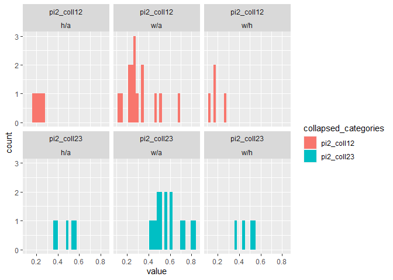

Malnutrition analysis
================

This model uses code developed by Nicky Welton to estimate the
association between malnutrition and pneumonia
mortality.

``` r
knitr::opts_chunk$set(echo = TRUE, warning = FALSE, message = FALSE, cache = TRUE)
knitr::opts_knit$set(root.dir = here::here())
```

Packages

``` r
library(tidyverse)
library(rjags)
library(ggplot2)
library(R2OpenBUGS)
```

# Nomenclature

For all analyses the malnutrition categories are interpreted as folows:-

| coding | label              |
| ------ | ------------------ |
| 1      | None               |
| 2      | Moderate           |
| 3      | Severe             |
| 12     | None or moderate   |
| 23     | Moderate or severe |

# Fixed effects model

## Run model with example data

First check the model runs succesfully in Jags using example data.

Need to convert the example data into matrices and vectors for JAGS.

``` r
metadata <- list(ng=3,ns=24)
ex_df <- read_delim("Supporting/example_data.txt", delim = "\t")
matrices <- list(r = NA, n = NA, g = NA)
matrices[] <- map(names(matrices), ~ ex_df %>% 
                  select(starts_with(.x), -na) %>% 
                  as.matrix())
na <- ex_df %>% pull(na)
pi2 <- ex_df %>% pull(pi2)


list_data <- c(matrices, 
               list(na = na, pi2 = pi2),
               metadata)
knitr::kable(ex_df)
```

| r1 |   n1 |  r2 |   n2 | r3 |  n3 | g1 | g2 | g3 | na | pi2 |
| -: | ---: | --: | ---: | -: | --: | -: | -: | -: | -: | --: |
|  9 |  140 |  23 |  140 | 10 | 138 |  1 |  2 |  3 |  3 | 1.0 |
| 11 |   78 |  12 |   85 | 29 | 170 |  1 |  2 |  3 |  3 | 1.0 |
| 75 |  731 | 363 |  714 | NA |   1 |  1 |  2 | NA |  2 | 1.0 |
|  2 |  106 |   9 |  205 | NA |   1 |  1 |  2 | NA |  2 | 1.0 |
| 58 |  549 | 237 | 1561 | NA |   1 |  1 |  2 | NA |  2 | 1.0 |
|  0 |   33 |   9 |   48 | NA |   1 |  1 |  2 | NA |  2 | 1.0 |
|  3 |  100 |  31 |   98 | NA |   1 |  1 |  2 | NA |  2 | 1.0 |
|  1 |   31 |  26 |   95 | NA |   1 |  1 |  2 | NA |  2 | 1.0 |
|  6 |   39 |  17 |   77 | NA |   1 |  1 |  2 | NA |  2 | 1.0 |
| 79 |  702 |  77 |  694 | NA |   1 |  2 |  3 | NA |  2 | 1.0 |
| 18 |  671 |  21 |  535 | NA |   1 |  2 |  3 | NA |  2 | 1.0 |
| 64 |  642 | 107 |  761 | NA |   1 | 12 |  3 | NA |  2 | 0.6 |
|  5 |   62 |   8 |   90 | NA |   1 | 12 |  3 | NA |  2 | 0.5 |
| 20 |  234 |  34 |  237 | NA |   1 | 12 |  3 | NA |  2 | 0.4 |
|  0 |   20 |   9 |   20 | NA |   1 |  1 | 23 | NA |  2 | 0.7 |
|  8 |  116 |  19 |  149 | NA |   1 |  1 | 23 | NA |  2 | 0.5 |
| 95 | 1107 | 143 | 1031 | NA |   1 |  1 | 23 | NA |  2 | 0.6 |
| 15 |  187 |  36 |  504 | NA |   1 |  1 | 23 | NA |  2 | 0.5 |
| 78 |  584 |  73 |  675 | NA |   1 |  1 | 23 | NA |  2 | 0.6 |
| 69 | 1177 |  54 |  888 | NA |   1 |  1 | 23 | NA |  2 | 0.3 |
| 20 |   49 |  16 |   43 | NA |   1 |  1 | 23 | NA |  2 | 0.8 |
|  7 |   66 |  32 |  127 | NA |   1 | 12 |  3 | NA |  2 | 0.7 |
| 12 |   76 |  20 |   74 | NA |   1 |  1 |  3 | NA |  2 | 1.0 |
|  9 |   55 |   3 |   26 | NA |   1 | 12 |  3 | NA |  2 | 0.7 |

## Run model

The following is the BUGS/JAGS code for the fixed effects model.

``` r
a <- read_lines("Supporting/FE_model.txt")
print(a)
```

    ##  [1] "model{                                                                       "                                           
    ##  [2] "for(i in 1:ns){                                                               # LOOP THROUGH STUDIES"                    
    ##  [3] "    delta[i,1]<-0"                                                                                                       
    ##  [4] "  mu[i] ~ dnorm(0,.0001)                                              # vague priors for all trial baselines"            
    ##  [5] "  for (k in 1:na[i]) {                                                       # LOOP THROUGH GROUPS"                      
    ##  [6] "    r[i,k] ~ dbin(p[i,k],n[i,k])                                           # binomial likelihood"                        
    ##  [7] "    logit(p[i,k]) <- mu[i] + delta[i,k]                                   # model for linear predictor"                  
    ##  [8] "     rhat[i,k] <- p[i,k] * n[i,k]                                            # expected value of the numerators"         
    ##  [9] "     dev[i,k] <- 2 * (r[i,k] * (log(r[i,k])-log(rhat[i,k]))             #Deviance contribution"                          
    ## [10] "         + (n[i,k]-r[i,k]) * (log(n[i,k]-r[i,k]) - log(n[i,k]-rhat[i,k])))"                                              
    ## [11] "  }"                                                                                                                     
    ## [12] "  resdev[i] <- sum(dev[i,1:na[i]])                        # summed residual deviance contribution for this trial"        
    ## [13] "  for (k in 2:na[i]) {                                           # LOOP THROUGH ARMS"                                    
    ## [14] "     delta[i,k] <-  di[i,g[i,k]] - di[i,g[i,1]]             # NMA model"                                                 
    ## [15] "  }"                                                                                                                     
    ## [16] "  for (k in 1:ng){"                                                                                                      
    ## [17] "    di[i,k]<-d[k]"                                                                                                       
    ## [18] "    }"                                                                                                                   
    ## [19] "  di[i,12]<-pi2[i]*d[2]"                                                                                                 
    ## [20] "  di[i,23]<-pi2[i]*d[2]+(1-pi2[i])*d[3]"                                                                                 
    ## [21] "}"                                                                                                                       
    ## [22] ""                                                                                                                        
    ## [23] "totresdev <- sum(resdev[])                                           #Total Residual Deviance"                           
    ## [24] "d[1]<- 0                                                                      # group effect is zero for reference group"
    ## [25] "for (k in 2:ng)  { d[k] ~ dnorm(0,.0001)}                           # vague priors for group effects"                    
    ## [26] ""                                                                                                                        
    ## [27] "# pairwise ORs and LORs for all possible pair-wise comparisons"                                                          
    ## [28] "for (c in 1:(ng-1)) {  for (k in (c+1):ng) {"                                                                            
    ## [29] "       or[c,k] <- exp(d[k] - d[c])"                                                                                      
    ## [30] "       lor[c,k] <- (d[k]-d[c])"                                                                                          
    ## [31] "      }"                                                                                                                 
    ## [32] "}"                                                                                                                       
    ## [33] ""                                                                                                                        
    ## [34] "}                                                                                 # *** PROGRAM ENDS"

## Check model runs with example data

``` r
mod_example <- jags.model(file = "Supporting/FE_model.txt",
                            data = list_data, n.chains = 1, n.adapt = 1000)
```

    ## Compiling model graph
    ##    Resolving undeclared variables
    ##    Allocating nodes
    ## Graph information:
    ##    Observed stochastic nodes: 50
    ##    Unobserved stochastic nodes: 26
    ##    Total graph size: 1371
    ## 
    ## Initializing model

``` r
update(mod_example, 100)

data(LINE)
LINE$recompile()
```

    ## Compiling model graph
    ##    Resolving undeclared variables
    ##    Allocating nodes
    ## Graph information:
    ##    Observed stochastic nodes: 5
    ##    Unobserved stochastic nodes: 3
    ##    Total graph size: 40
    ## 
    ## Initializing model

``` r
LINE.out <- coda.samples(mod_example, c("d"),n.iter = 100)
summary(LINE.out)
```

    ## 
    ## Iterations = 1101:1200
    ## Thinning interval = 1 
    ## Number of chains = 1 
    ## Sample size per chain = 100 
    ## 
    ## 1. Empirical mean and standard deviation for each variable,
    ##    plus standard error of the mean:
    ## 
    ##        Mean      SD Naive SE Time-series SE
    ## d[1] 0.0000 0.00000 0.000000        0.00000
    ## d[2] 0.9106 0.07143 0.007143        0.01646
    ## d[3] 0.5941 0.07767 0.007767        0.01791
    ## 
    ## 2. Quantiles for each variable:
    ## 
    ##        2.5%    25%    50%    75%  97.5%
    ## d[1] 0.0000 0.0000 0.0000 0.0000 0.0000
    ## d[2] 0.7525 0.8742 0.9234 0.9492 1.0330
    ## d[3] 0.4600 0.5355 0.5978 0.6503 0.7305

## Process real data into format for analysis

Process real data, in the first instance assume that the proportion in
each category is known for all data.

First rename variables and recode. There should be a maximum of three
groups for each study/malnutrition category type
combination.

## Categorise pattern of collapsing for each study/manutrition category combination

Calculate which studies have missing event data, and which have missing
“n” data. IN the present analysis, any with complete n data have
complete events data.

``` r
mort <- read_csv("Data/Mortality_Numbers.csv")
names(mort) <- str_to_lower(names(mort)) 
names(mort) <- str_replace_all(names(mort), " ", "_")

mort <- mort %>% 
  mutate_at(vars(survived, died, total), as.integer)

mort <- mort %>% 
  group_by(study, measure) %>% 
  mutate(all_missing = all(is.na(total))) %>% 
  ungroup() %>% 
  filter(!all_missing) %>% 
  select(-all_missing)

maln_cat3 <- c("None", "Moderate", "Severe")

mort <- mort %>% 
  group_by(study, malnutrition_category) %>% 
  mutate(all_n =  all(maln_cat3 %in% malnutrition_severity) & !any(is.na(total)),
            all_r =  all(maln_cat3 %in% malnutrition_severity) & !any(is.na(died)),
            col12 = !all(maln_cat3 %in% malnutrition_severity) & any(malnutrition_severity == "All"),
            col23 = !all(maln_cat3 %in% malnutrition_severity) & any(malnutrition_severity == "Non-Severe")) %>% 
  ungroup() 

all_present_smry <- mort %>% 
  distinct(study, malnutrition_category, .keep_all = TRUE) %>% 
  group_by(all_n, all_r, col12, col23) %>% 
  summarise(studies = sum(!duplicated(study)),
            studies_times_categories = n())
col12 <- all_present_smry$studies[all_present_smry$col12]
col23 <- all_present_smry$studies[all_present_smry$col23]
knitr::kable(all_present_smry)
```

| all\_n | all\_r | col12 | col23 | studies | studies\_times\_categories |
| :----- | :----- | :---- | :---- | ------: | -------------------------: |
| FALSE  | FALSE  | FALSE | TRUE  |       9 |                          9 |
| FALSE  | FALSE  | TRUE  | FALSE |       4 |                          6 |
| TRUE   | TRUE   | FALSE | FALSE |      14 |                         19 |

Of those studies with collapsed data, 4 collapse into none/moderate and
9 collapse into moderate severe.

## Calculate the proportion in group 2 for the collapsed studies

Since, in the sample so far, all of those with missing event data have
missing totals for each category, we can only examine the proportion in
group 2 where there is complete data. Calculate the proportion in the
second category (moderate malnutrition) within each collapsed category.
Having done so collapse the Ns. Where the proportion is unknown, assume
it is the same as the mean proportion.

First need to classify which are collapsed.

``` r
pi2 <- mort %>% 
  filter(all_n) %>% 
  select(study, malnutrition_category, malnutrition_severity, total) %>% 
  mutate(total = as.integer(total)) %>% 
  spread(malnutrition_severity, total) %>% 
  mutate(pi2_coll12 = Moderate/(Moderate + None),
         pi2_coll23 = Moderate/(Moderate + Severe)) %>% 
  select(study, malnutrition_category, pi2_coll12, pi2_coll23)


pi2_for_mdl <- mort %>% 
  filter(all_n) %>% 
  select(study, malnutrition_category, malnutrition_severity, total) %>% 
  mutate(total = as.integer(total)) %>% 
  spread(malnutrition_severity, total) %>% 
  group_by(study, malnutrition_category) %>% 
  summarise_at(vars(-study, -malnutrition_category), sum) %>% 
  ungroup()

cat_names <- unique(pi2_for_mdl$malnutrition_category) %>%  sort()
pi2_for_mdl <- map(cat_names, ~ pi2_for_mdl %>% 
                     filter(malnutrition_category == .x) %>% 
                     select(None, Moderate, Severe) %>% 
                     as.matrix())
names(pi2_for_mdl) <- cat_names

pi2_smry <- pi2 %>% 
  group_by(malnutrition_category) %>% 
  summarise_at(vars(pi2_coll12, pi2_coll23), mean) %>% 
  ungroup()

pi2_lng <- pi2 %>% 
  gather("collapsed_categories", "value", pi2_coll12, pi2_coll23) 
plot_dist <- ggplot(pi2_lng, aes(x = value, fill = collapsed_categories)) + geom_histogram() +
  facet_wrap(collapsed_categories ~ malnutrition_category)
plot_dist
```

<!-- -->

The plot above shows the proportion of participants category 2 of 1 + 2
and in category 2 of 2+3 for all three types of measure. The proportion
in 2 (moderate) is sometimes surprisingly low or high.

``` r
mort_slct <- mort %>% 
  select(study, malnutrition_category, n = total, r = died, maln = malnutrition_severity,
         col12, col23) %>% 
  inner_join(pi2_smry) %>%
  mutate(pi2 = case_when(
    col12 ~ pi2_coll12,
    col23 ~ pi2_coll23,
    TRUE ~ 1
  ))
  

grp_lbls <-  mort_slct %>% 
  group_by(study, malnutrition_category) %>% 
  mutate(g = seq_along(study)) %>% 
  ungroup() %>% 
  mutate(g_lbl = case_when(
    maln == "None" ~ 1L,
    maln == "Moderate" ~ 2L,
    maln == "Severe" ~ 3L,
    maln == "Non-Severe" ~ 12L,
    maln == "All" ~ 23L)
  )
```

First run for the “w/a” definition of malnutrition.

THis code rearranges the dataframe so that we have a matrix of N’s,
events and group labels as per the earlier structure.

``` r
grp_lbls2 <- grp_lbls %>% 
  select(study, malnutrition_category, r, n, g, g_lbl, pi2) %>% 
  filter(malnutrition_category == "w/a") %>% 
  distinct(study, g, .keep_all = TRUE)

grp_lbls2n <- grp_lbls2 %>% 
  select(-r, -g_lbl) %>% 
  spread(g, n)

grp_lbls2n <- grp_lbls2 %>% 
  select(-r, -g_lbl) %>% 
  spread(g, n)

grp_lbls2r <- grp_lbls2 %>% 
  select(-n, -g_lbl) %>% 
  spread(g, r)

grp_lbls2g <- grp_lbls2 %>% 
  select(-n, -r) %>% 
  spread(g, g_lbl)

grp_lbls2_col12 <- grp_lbls2 %>% 
  group_by(study) %>% 
  summarise(res = any(12 %in% g_lbl)) %>% 
  pull(res)
```

Check that the restructuring has kept the order of the studies. The
following tests should be TRUE.

``` r
identical(grp_lbls2n %>% select(1:2),
          grp_lbls2g %>%  select(1:2))
```

    ## [1] TRUE

``` r
identical(grp_lbls2n %>% select(1:2),
          grp_lbls2r %>%  select(1:2))
```

    ## [1] TRUE

## Try running models on real data

Simplest model, assume that the proportion with moderate malnutrition of
those with none-moderate, and the proportion with moderate of thsoe with
moderate-severe are constant across studies where this is not
recorded.

``` r
na <- 3 - apply(grp_lbls2n %>% select(`1`, `2`, `3`) %>% as.matrix(), 1, function(x) x %>% 
        as.integer() %>% 
        is.na() %>% 
        sum())
list_data2 <- list(r = grp_lbls2r %>% select(`1`, `2`, `3`) %>% as.matrix(),
                   n = grp_lbls2n %>% select(`1`, `2`, `3`) %>% as.matrix(),
                   g = grp_lbls2g %>% select(`1`, `2`, `3`) %>% as.matrix(),
                   na = na,
                   pi2 = grp_lbls2$pi2,
                   ng = 3,
                   ns = nrow(grp_lbls2n))
```

``` r
mod1 <- jags.model(file = "Supporting/FE_model.txt",
                            data = list_data2, n.chains = 1, n.adapt = 1000)
```

    ## Compiling model graph
    ##    Resolving undeclared variables
    ##    Allocating nodes
    ## Graph information:
    ##    Observed stochastic nodes: 57
    ##    Unobserved stochastic nodes: 24
    ##    Total graph size: 1495
    ## 
    ## Initializing model

``` r
update(mod1, 1000)

data(LINE)
LINE$recompile()
```

    ## Compiling model graph
    ##    Resolving undeclared variables
    ##    Allocating nodes
    ## Graph information:
    ##    Observed stochastic nodes: 5
    ##    Unobserved stochastic nodes: 3
    ##    Total graph size: 40
    ## 
    ## Initializing model

``` r
LINE.out <- coda.samples(mod1, c("d"),n.iter = 1000)
summary(LINE.out)
```

    ## 
    ## Iterations = 2001:3000
    ## Thinning interval = 1 
    ## Number of chains = 1 
    ## Sample size per chain = 1000 
    ## 
    ## 1. Empirical mean and standard deviation for each variable,
    ##    plus standard error of the mean:
    ## 
    ##        Mean      SD  Naive SE Time-series SE
    ## d[1] 0.0000 0.00000 0.0000000       0.000000
    ## d[2] 0.8166 0.03092 0.0009779       0.001927
    ## d[3] 1.4684 0.02792 0.0008829       0.001394
    ## 
    ## 2. Quantiles for each variable:
    ## 
    ##       2.5%    25%    50%    75%  97.5%
    ## d[1] 0.000 0.0000 0.0000 0.0000 0.0000
    ## d[2] 0.755 0.7949 0.8173 0.8377 0.8752
    ## d[3] 1.415 1.4488 1.4685 1.4872 1.5217

The above tables show that the log odds ratio is 0.82 for moderate
versus none and 1.47 for severe versus none.

## Next step

Next step will be to estimate the proportion of people in category two
rather than assume it is fixed. Can estimate this from the data or can
get input from subject-matter experts about the likely proportion.

In order to prepare for this final decision we developed two models. One
model assumes (approach one) that the proportion of none-moderate which
are moderate lies, with equal probability, somehere between 0 and 1 and
that the proportion of moderate-severe which are moderate lies between 0
and 1 (ie a uniform prior). A second model (approach two) assumes that
the proportion in each category is exchangeable between studies, using a
random effects model to estimate the proportion for those studies where
it is not recorded.

These models (which for speed only run for a small number of samples)
both give similar result.

### Approach One

Add an indicator variables for whether we want proportion in category
two of 1 and 2, or of 2 and 3. Where there is no missing data, the
proportion of two in 2/3 will be calculated, but this is not used in the
code.

In the first instance explore the use of a flat distribution for the
proportion in category two. This is run in both JAGS and OPENBUGS,
giving the same results.

``` r
list_data3 <- list_data2
list_data3[["pi2"]] <- NULL
list_data3[["coll12"]] <- grp_lbls2_col12
mod2 <- jags.model(file = "Supporting/FE_model_estimate_prop.txt",
                            data = list_data3, n.chains = 1, n.adapt = 1000)
```

    ## Compiling model graph
    ##    Resolving undeclared variables
    ##    Allocating nodes
    ## Graph information:
    ##    Observed stochastic nodes: 57
    ##    Unobserved stochastic nodes: 26
    ##    Total graph size: 1482
    ## 
    ## Initializing model

``` r
update(mod2, 1000)

data(LINE)
LINE$recompile()
```

    ## Compiling model graph
    ##    Resolving undeclared variables
    ##    Allocating nodes
    ## Graph information:
    ##    Observed stochastic nodes: 5
    ##    Unobserved stochastic nodes: 3
    ##    Total graph size: 40
    ## 
    ## Initializing model

``` r
LINE.out <- coda.samples(mod2, c("d", "theta1", "theta2"),n.iter = 1000)
summary(LINE.out)
```

    ## 
    ## Iterations = 2001:3000
    ## Thinning interval = 1 
    ## Number of chains = 1 
    ## Sample size per chain = 1000 
    ## 
    ## 1. Empirical mean and standard deviation for each variable,
    ##    plus standard error of the mean:
    ## 
    ##           Mean      SD  Naive SE Time-series SE
    ## d[1]   0.00000 0.00000 0.0000000       0.000000
    ## d[2]   0.83112 0.02982 0.0009430       0.001741
    ## d[3]   1.46035 0.03036 0.0009601       0.001666
    ## theta1 0.05598 0.04892 0.0015470       0.002621
    ## theta2 0.76963 0.19427 0.0061434       0.012508
    ## 
    ## 2. Quantiles for each variable:
    ## 
    ##            2.5%     25%     50%     75%  97.5%
    ## d[1]   0.000000 0.00000 0.00000 0.00000 0.0000
    ## d[2]   0.774545 0.80980 0.83172 0.85032 0.8925
    ## d[3]   1.402392 1.43998 1.46050 1.48177 1.5195
    ## theta1 0.003016 0.01977 0.04071 0.07875 0.1817
    ## theta2 0.252135 0.67737 0.82317 0.91967 0.9912

``` r
inits <- function() {
  list(d = c(NA,-2,1),
       mu = rep(0, nrow(list_data3$r)))
}
list_data3_openbugs <- list_data3
list_data3_openbugs$coll12 <- as.integer(list_data3_openbugs$coll12)
mode2_bugs <- bugs(data = list_data3_openbugs, 
                   parameters.to.save = c("d", "theta1", "theta2"), n.iter = 1000,
                   inits = inits,
                   model.file = "FE_model_estimate_prop_openbugs.txt")
print(mode2_bugs)
```

    ## Inference for Bugs model at "FE_model_estimate_prop_openbugs.txt", 
    ## Current: 3 chains, each with 1000 iterations (first 500 discarded)
    ## Cumulative: n.sims = 1500 iterations saved
    ##           mean  sd  2.5%   25%   50%   75% 97.5% Rhat n.eff
    ## d[2]       0.8 0.0   0.8   0.8   0.8   0.8   0.9    1  1100
    ## d[3]       1.5 0.0   1.4   1.4   1.5   1.5   1.5    1   760
    ## theta1     0.1 0.1   0.0   0.0   0.0   0.1   0.2    1   560
    ## theta2     0.8 0.2   0.3   0.7   0.8   0.9   1.0    1  1500
    ## deviance 434.9 7.4 422.9 429.4 434.1 439.4 451.2    1  1500
    ## 
    ## For each parameter, n.eff is a crude measure of effective sample size,
    ## and Rhat is the potential scale reduction factor (at convergence, Rhat=1).
    ## 
    ## DIC info (using the rule, pD = Dbar-Dhat)
    ## pD = 24.5 and DIC = 459.4
    ## DIC is an estimate of expected predictive error (lower deviance is better).

### Approach Two

This is the modelling where we estimate the proportion in the moderate
category using the data on proportions from other studies.

``` r
pi2_choose <- pi2_for_mdl$`w/a`
pi2_choose12 <- rowSums(pi2_choose[, 1:2])
pi2_choose23 <- rowSums(pi2_choose[, 2:3])

list_data4 <- list_data3
list_data4[["n_complete2a"]]   <- pi2_choose[,2]
list_data4[["n_complete2b"]]   <- pi2_choose[,2]
list_data4[["n_complete12"]] <- pi2_choose12
list_data4[["n_complete23"]] <- pi2_choose23
list_data4[["ns_complete"]] <- length(pi2_choose12)


mod3 <- jags.model(file = "Supporting/FE_model_estimate_prop2.txt",
                            data = list_data4, n.chains = 1, n.adapt = 1000)
```

    ## Compiling model graph
    ##    Resolving undeclared variables
    ##    Allocating nodes
    ## Graph information:
    ##    Observed stochastic nodes: 83
    ##    Unobserved stochastic nodes: 56
    ##    Total graph size: 1648
    ## 
    ## Initializing model

``` r
update(mod3, 1000)

data(LINE)
LINE$recompile()
```

    ## Compiling model graph
    ##    Resolving undeclared variables
    ##    Allocating nodes
    ## Graph information:
    ##    Observed stochastic nodes: 5
    ##    Unobserved stochastic nodes: 3
    ##    Total graph size: 40
    ## 
    ## Initializing model

``` r
LINE.out <- coda.samples(mod3, c("d", "theta1_prop", "theta2_prop"),n.iter = 1000)
summary(LINE.out)
```

    ## 
    ## Iterations = 2001:3000
    ## Thinning interval = 1 
    ## Number of chains = 1 
    ## Sample size per chain = 1000 
    ## 
    ## 1. Empirical mean and standard deviation for each variable,
    ##    plus standard error of the mean:
    ## 
    ##               Mean      SD  Naive SE Time-series SE
    ## d[1]        0.0000 0.00000 0.0000000       0.000000
    ## d[2]        0.8235 0.02944 0.0009311       0.001507
    ## d[3]        1.4438 0.02903 0.0009180       0.001553
    ## theta1_prop 0.2974 0.04785 0.0015131       0.001513
    ## theta2_prop 0.6258 0.03852 0.0012181       0.001218
    ## 
    ## 2. Quantiles for each variable:
    ## 
    ##               2.5%    25%    50%    75%  97.5%
    ## d[1]        0.0000 0.0000 0.0000 0.0000 0.0000
    ## d[2]        0.7658 0.8041 0.8247 0.8434 0.8777
    ## d[3]        1.3841 1.4249 1.4442 1.4645 1.4980
    ## theta1_prop 0.2120 0.2667 0.2941 0.3252 0.4017
    ## theta2_prop 0.5463 0.6031 0.6272 0.6496 0.6973

# Random effects model

Return to approach 1, but re-run the model assuming random effects model
for the effect of malnutrition on mortality.

``` r
mode3_bugs <- bugs(data = list_data3_openbugs, 
                   parameters.to.save = c("d", "theta1", "theta2"), n.iter = 10000,
                   inits = inits,
                   model.file = "RE_model_estimate_prop_openbugs.txt")
print(mode3_bugs)
```

    ## Inference for Bugs model at "RE_model_estimate_prop_openbugs.txt", 
    ## Current: 3 chains, each with 10000 iterations (first 5000 discarded)
    ## Cumulative: n.sims = 15000 iterations saved
    ##           mean   sd  2.5%   25%   50%   75% 97.5% Rhat n.eff
    ## d[2]       0.8  0.1   0.5   0.7   0.8   0.9   1.1    1  3800
    ## d[3]       1.6  0.1   1.4   1.6   1.6   1.7   1.9    1  4200
    ## theta1     0.2  0.2   0.0   0.1   0.1   0.2   0.6    1  9000
    ## theta2     0.7  0.2   0.2   0.6   0.8   0.9   1.0    1 15000
    ## deviance 341.5 10.4 323.1 334.1 340.9 348.1 363.4    1  7000
    ## 
    ## For each parameter, n.eff is a crude measure of effective sample size,
    ## and Rhat is the potential scale reduction factor (at convergence, Rhat=1).
    ## 
    ## DIC info (using the rule, pD = Dbar-Dhat)
    ## pD = 44.5 and DIC = 386.0
    ## DIC is an estimate of expected predictive error (lower deviance is better).

This gives very similar results, but with wider confidence intervals,
than the fixed effects model.
